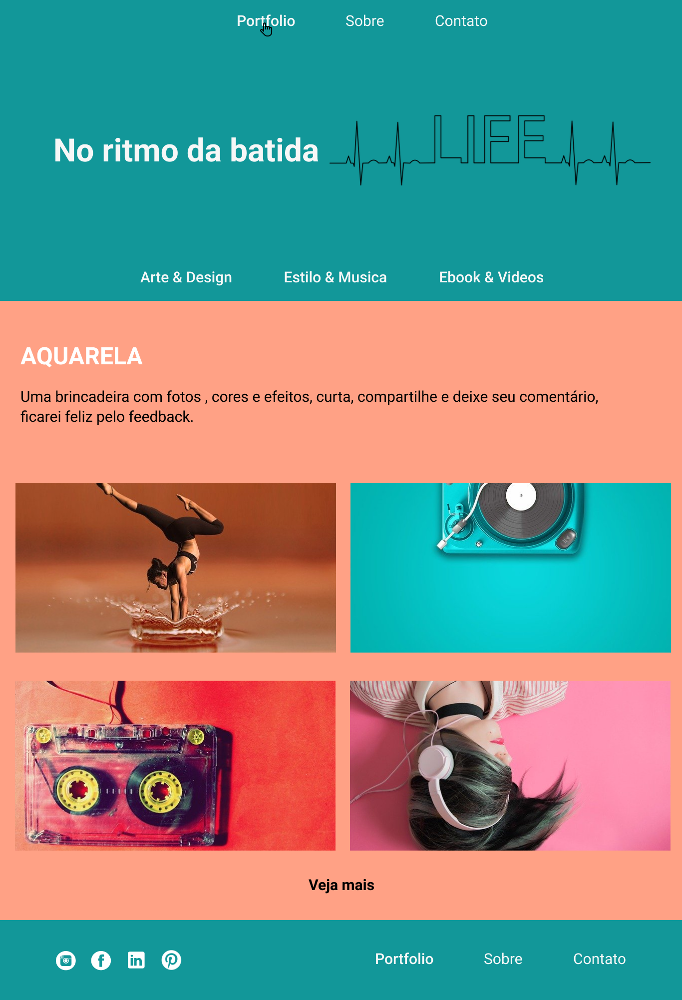

<h1 align="center">
  
 VNW - Desafio 03</a>
</h1>

Todas os suas músicas favoritas em um só lugar.

Acesse o site do <a href="https://vnw-desafio03.vercel.app" target="_blank">Beat App</a>.

 <a href="#Descrição">Descrição</a> •
 <a href="#Tecnologias">Tecnologias utilizadas</a> •
 <a href="#autor">Autor</a>

---

 

<h1 align="center">  
  

    

</h1>

### Descrição

O projeto consiste em um desafio do <a href="https://vainaweb.com.br/" target="_blank">Vai Na Web</a> onde foi proposto criar uma página para um aplicativo de músicas com as tecnologias **HTML** com **CSS** e **Javascript**.

### Tecnologias utilizadas

As seguintes ferramentas foram usadas na construção do projeto:

- HTML5
- CSS3
- Javascript
- Bootstrap

---

### Autor

Made with 💜 by Renan Cesar 👋

